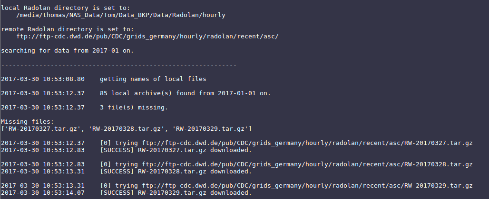

# raddo - RADOLAN weather radar download

*raddo* downloads RADOLAN weather radar ascii data (*tar.gz). Downloaded files are sorted in folders based on year and month and may also be untarred.

RADOLAN data from the German Weather Service (Deutscher Wetterdienst, DWD) is copyrighted! Please find the copyright text [here](https://opendata.dwd.de/climate_environment/CDC/Terms_of_use.pdf).
The freely accessible data may be re-used without any restrictions provided that the source reference is indicated, as laid down in the GeoNutzV ordinance.

*raddo* tries to download all recent RADOLAN ascii files / archives from DWD FTP to the specified directory if files do not exist already. A list of dates possibly available (default 2019-01-01 until today) is used to compare hypothetical available data sets with actual local available ones. So file listing on the FTP side is skipped due to (formerly) unreliable connection.
The RADOLAN precipitation data files are *updated daily* by DWD.


The data can be found at [opendata.dwd.de](https://opendata.dwd.de/climate_environment/CDC/grids_germany/hourly/radolan/recent/asc/ "https://opendata.dwd.de/climate_environment/CDC/grids_germany/hourly/radolan/recent/asc/").

## Usage ##

``` sh
usage: raddo [-h] [-u URL] [-d DIRECTORY] [-s START] [-e END] [-r ERRORS] [-f]
             [-x]

Utility to download RADOLAN data from DWD servers.

optional arguments:
  -h, --help            show this help message and exit
  -u URL, --radolan_server_url URL
                        Path to recent .asc RADOLAN data on DWD servers.
                        Default: https://opendata.dwd.de/climate_environment/C
                        DC/grids_germany/hourly/radolan/recent/asc/
  -d DIRECTORY, --directory DIRECTORY
                        Path to local directory where RADOLAN shouldbe (and
                        may already be) saved. Default:
                        /home/tramsauer/Code/raddo
  -s START, --start START
                        Start date as parsable string (e.g. "2018-05-20").
                        Default: 2019-01-01
  -e END, --end END     End date as parsable string (e.g. "2018-05-20").
                        Default: 2019-10-15 18:32:10.296252
  -r ERRORS, --Errors-allowed ERRORS
                        Errors allowed when contacting DWD Server. Default: 5
  -f, --sort-in-folders
                        Should the data be sorted in folders?
  -x, --extract         Should the data be extracted?

```

### Crontab ###

An entry in crontab could be used to download the data. E.g.:

``` bash
0 12 * * 1-5 /home/user/path/to/raddo/rad_down.sh
```

To have the following skript running every weekday at 12:00 noon.

``` sh
#!/usr/bin/env bash
export PATH="$HOME/.anaconda3/bin:$PATH"
DIR="$( cd "$( dirname "${BASH_SOURCE[0]}" )" && pwd )"
date=$(date)
header="\n--------------------------\n"$date" executing raddo:\n"
echo -e $header >> $DIR"/raddo.log"
python ~/path/to/raddo/raddo.py &>> $DIR"/raddo.log"
```

This adds the anaconda path to the `$PATH` variable. Furthermore, it uses the
directory which the shell script is executed from as `$DIR` to write/append the
`$header`and `stdout` to a custom log file (`raddo.log`).

``` sh
sort_tars.sh && untar_default.sh
```
may be added to fully extract and sort the downloaded archives.


### Python script ####

 With `python raddo.py` the comparison and download can be started in the shell with the default values.
 Variables and their defaults are:

 ```
    PARAMETERS:
    -------------------------
        rad_dir_dwd: string
            Link to Radolan products on DWD FTP server.
            defaults to "https://opendata.dwd.de/climate_environment/CDC/
                         grids_germany/hourly/radolan/recent/asc/")

        rad_dir: string
            local directory to be processed / already containing radolan data.
            defaults to current working directory

        start_date: string
            parsable date string (default "2019-01")

        end_date: string
            parsable date string (defaults to current date)

        errors_allowed: integer
            number of tries to download one file (default: 5)

 ```

#### General Usage:
``` python
import raddo as rd

rd.radolan_down(rad_dir_dwd = ...,  )
```
#### The terminal prompt may look something like this:


