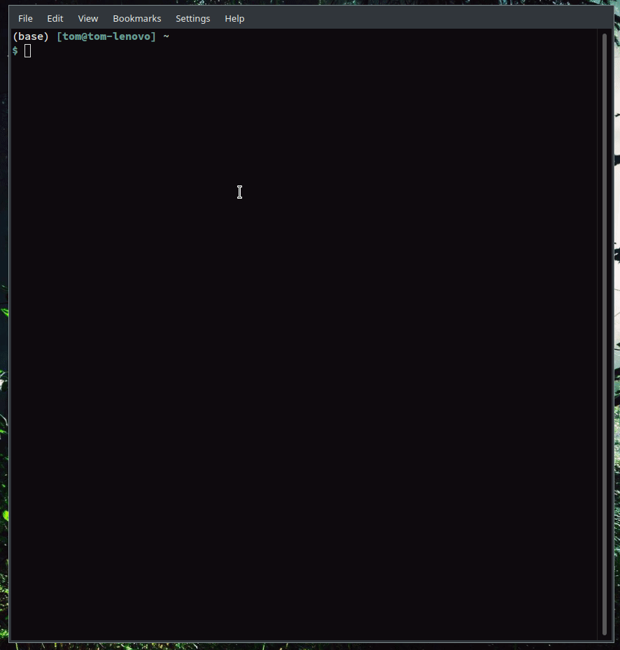

# raddo

[](LICENSE.txt)


*raddo* is a no-frills software that prepares RADOLAN weather radar precipitation data for simple usage.

*raddo* downloads RADOLAN weather radar ascii data (*tar.gz). Downloaded files are sorted in folders based on year and month and may also be untarred.

RADOLAN data from the German Weather Service (Deutscher Wetterdienst, DWD) is copyrighted! Please find the copyright text [here](https://opendata.dwd.de/climate_environment/CDC/Terms_of_use.pdf).
The freely accessible data may be re-used without any restrictions provided that the source reference is indicated, as laid down in the GeoNutzV ordinance.

*raddo* tries to download all recent RADOLAN ascii files / archives from DWD FTP to the specified directory if files do not exist already. A list of dates possibly available (default 2019-01-01 until today) is used to compare hypothetical available data sets with actual local available ones. So file listing on the FTP side is skipped due to (formerly) unreliable connection.
The RADOLAN precipitation data files are *updated daily* by DWD.


The data can be found at [opendata.dwd.de](https://opendata.dwd.de/climate_environment/CDC/grids_germany/hourly/radolan/recent/asc/ "https://opendata.dwd.de/climate_environment/CDC/grids_germany/hourly/radolan/recent/asc/").


## Installation

Clone this repository, change into new directory and run:

``` sh
git clone <repo-url>
cd raddo
python setup.py install
```

or
``` sh
python setup.py develop
```
if you want to work on the code.

## Usage

Download RADOLAN data from *{current-year}-01-01* till *today* to current directory with `raddo`. For further arguments consult the help text:


``` sh
usage: raddo [-h] [-u URL] [-d DIRECTORY] [-s START] [-e END] [-r ERRORS] [-f]
             [-x] [-g] [-n] [-C] [-y] [-F] [-D] [-v]

raddo - utility to download RADOLAN data from DWD servers and prepare for
simple usage.

optional arguments:
  -h, --help            show this help message and exit
  -u URL, --radolan_server_url URL
                        Path to recent .asc RADOLAN data on DWD servers.
                        Default: https://opendata.dwd.de/climate_environment/C
                        DC/grids_germany/hourly/radolan/recent/asc/
  -d DIRECTORY, --directory DIRECTORY
                        Path to local directory where RADOLAN shouldbe (and
                        may already be) saved. Checks for existing files only
                        if this flag is set. Default: /tmp/raddo_test (current
                        directory)
  -s START, --start START
                        Start date as parsable string (e.g. "2018-05-20").
                        Default: 2020-01-01 (current year\'s Jan 1st)
  -e END, --end END     End date as parsable string (e.g. "2018-05-20").
                        Default: 2020-07-09 (yesterday)
  -r ERRORS, --errors-allowed ERRORS
                        Errors allowed when contacting DWD Server. Default: 5
  -f, --sort-in-folders
                        Should the data be sorted in folders?
  -x, --extract         Should the data be extracted?
  -g, --geotiff         Set if GeoTiffs in EPSG:4326 should be created for
                        newly downloaded files.
  -n, --netcdf          Create a NetCDF from GeoTiffs?
  -C, --complete        Run all subcommands. Same as using flags -fxgn.
  -y, --yes             Skip user input. Just accept to download to current
                        directory if not specified otherwise.
  -F, --force           Forces local file search. Omits faster check of
                        ".raddo_local_files.txt".
  -D, --force-download  Forces download of all files.
  -v, --version         Print information on software version.

```
### Example





### Crontab ###

An entry in crontab could be used to download the data. E.g.:

``` bash
0 12 * * 1-5 raddo -fx -d /path/to/radolan/data/
```

To have the following skript running every weekday at 12:00 noon.

``` sh
#!/usr/bin/env bash
export PATH="$HOME/.anaconda3/bin:$PATH"
DIR="$( cd "$( dirname "${BASH_SOURCE[0]}" )" && pwd )"
date=$(date)
header="\n--------------------------\n"$date" executing raddo:\n"
echo -e $header >> $DIR"/raddo.log"
python ~/path/to/raddo/raddo.py &>> $DIR"/raddo.log"
```

This adds the anaconda path to the `$PATH` variable. Furthermore, it uses the
directory which the shell script is executed from as `$DIR` to write/append the
`$header`and `stdout` to a custom log file (`raddo.log`).

``` sh
sort_tars.sh && untar_default.sh
```
may be added to fully extract and sort the downloaded archives.


### Python script

``` python
import raddo as rd

rd.radolan_down(rad_dir_dwd = ...,  )
```

 Variables and their defaults are:

 ```
    PARAMETERS:
    -------------------------
        rad_dir_dwd: string
            Link to Radolan products on DWD FTP server.
            defaults to "https://opendata.dwd.de/climate_environment/CDC/
                         grids_germany/hourly/radolan/recent/asc/")

        rad_dir: string
            local directory to be processed / already containing radolan data.
            defaults to current working directory

        start_date: string
            parsable date string (default "2019-01")

        end_date: string
            parsable date string (defaults to current date)

        errors_allowed: integer
            number of tries to download one file (default: 5)

        force:
            Forces local file search. Omits faster check of
            .raddo_local_files.txt".

        force_down:
            Forces download of all files.

 ```

## Warnings

- currently, if a shapefile mask is applied, sub optimal *nearest neighbour resampling* is applied (as other methods were not functional in gdal python bindings..(?)).
- if geotiffs are not wanted, they need to be created anyways, and processing might fill up your *tempfs* in `/tmp`..
- if multiple polygons are used as mask, they are dissolved & buffered.

## Contributing

See [CONTRIBUTIONS](CONTRIBUTIONS.md) document.

## License
[](LICENSE.txt)

Please find the license aggreement in [LICENSE.txt](LICENSE.txt)

## Changes

See [Changelog](CHANGELOG.rst) document.

## Further Development

- [X] add historical
- [X] integrate GeoTiff generation (reprojection)
- [X] integrate aggregation to NetCDF files
- [X] add tests!
- [ ] add docs
- [ ] add DOI
- [ ] pip install?
- [ ] add pypi install
- [ ] add conda install
- [X] gif for cli

## See also

- [wradlib](https://github.com/wradlib/wradlib):
  > An Open Source Library for Weather Radar Data Processing

- [radproc](https://github.com/jkreklow/radproc):
  > A GIS-compatible Python-Package for automated RADOLAN Composite Processing and Analysis
