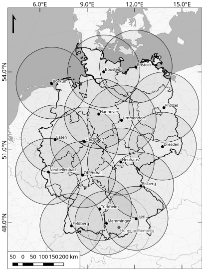

# Summary

Precipitation is of paramount importance when studying the water cycle which in turn drives the global climate and climate change.
Good knowledge on the parts of this mass and energy system is much needed to study different events, e.g. droughts or flooding events, that may impact humans in their daily life.
For example soil moisture and land cover and therefore agriculture hence food production is highly dependent on rainfall.
Science on hydroclimatic extremes investigates atmospheric conditions which may lead to devastating flooding events.
Accurate input to improve hydrological model setups is a necessity for such scientific groups.
Also, general climate modeling requires precise precipitation data to validate against.
However, hydrological modeling communities struggle to get reliable data for this essential climate variable (ECV).

There are several measuring methods for precipitation with the most prominent in society being traditionl gauge data.
Point scale data inherits limited informative value for nearby areas (kilometers) which is a big drawback for to hydrological applications.
A spatial representative precipitation data set is thus required.
In the last decades satellite missions where launched to measure precipitation from space.
These data sets come with peculiar uncertainties (e.g. winter) and resolutions up to .1° / ~10 km (Global Precipitation Measurement Mission) [@Ramsauer2018].
Weather radars also provide areal representations of the rainfall around the station's location and can deliver data at a high sampling rate and spatial resolution.

RADOLAN is the German weather radar system operated by the Deutscher Wetterdienst (DWD) [@Bartels2004; @Winterrath2012; @Winterrath2019].
It is a gauge adjusted precipitation data set with spatial, temporal and radiometric resolution of 1 km, 1 hourly, .1 mm/h respectively.
The data set is utilized in several studies already [@Haensel2019; @Bronstert2018; @Fischer2016; @Kreklow2020; @Kreklow2020a; @Ramsauer2018; @Ramsauer2021b]
An overview of the contributing C-Band weather radar stations and the respective 150km reach is shown in the following figure.

However, retrieval, prepocessing and usage of this data is not trivial. A DWD specific stereographic projection of the files complicates the usage for many as well as the fact, that the massive amount of files is available in two different repositories (historical, recent) and two data formats: ascii and binary.

## Statement of need

The overall goal of the software is to make the RADOLAN (RW) data set more accessible to users. A short investigation of single dates e.g. for flooding antecedent precipitation situation is easily possible with ``raddo``. The burden of searching and aggregating the files from different repositories and reprojecting to a more widely used geographic coordinate system is taken off the user of `raddo`. Furthermore, masking the output is possible, so that only the desired region of interest is processed. `raddo` makes further scientific work with the RADOLAN data set easy and straightforward.
Other software dealing with RADOLAN data is listed in the Reference section. `raddo`'s unique feature is its simplicity in usage. Users not normally working with radar data sets but in need of a high quality, high temporal resolution precipitation data set now can utilize the RADOLAN data set in their scientific work.

## Software description
``raddo`` is a python package for retrieval and preprocessing of RADOLAN weather radar data and the name stands for RADolan DOwnload and preprocessing software. A [docker image](https://hub.docker.com/r/tramsauer/raddo "docker hub") is furthermore provided.

The software operates in several steps which can be accessed through the commandline interface.
Firstly, a local list of potentially to load data sets is generated. This step alleviates DWD's server from too many requests and is also based on difficulties in reaching the data store of RADOLAN data.
Next, download requests are sent to the *recent* and *historical* repository of DWD based on given parameters.
The data is extracted and sorted hierarchically based on date.
`raddo` uses the Geospatial Data Abstraction Library (GDAL) module then helps transforming the polar-stereographically projected weather radar data to the widely used WGS84 system. The DWD internal
, the data is converted to GeoTiff and aggregated to a NetCDF file.
Subsequent requests consider already cached data.

# Abbreviations

|         |                                                  |
|:--------|:-------------------------------------------------|
| DWD     | Deutscher Wetterdienst  (German Weather Service) |
| ECV     | Essential Climate Variable                       |
| GDAL    | Geospatial Data Abstraction Library              |
| NetCDF  | Network Common Data Form                         |
| RADOLAN | RADar OnLine ANeichung (radar online adjustment) |
| WGS84   | World Geodetic System (84)                       |
|         |                                                  |

# Acknowledgements

We acknowledge DWD for openly providing the RADOLAN RW data free of charge.
The project leading to this application has received funding from the European Union's Horizon 2020 research and innovation program under Grant Agreement No. 687320.

Other software for further processing of RADOLAN data has been developed:

- [wradlib](https://github.com/wradlib/wradlib) [@Heistermann2013]
An Open Source Library for Weather Radar Data Processing
- [radproc](https://github.com/jkreklow/radproc) [@Kreklow2019]
A GIS-compatible Python-Package for automated RADOLAN Composite Processing and Analysis

# References
